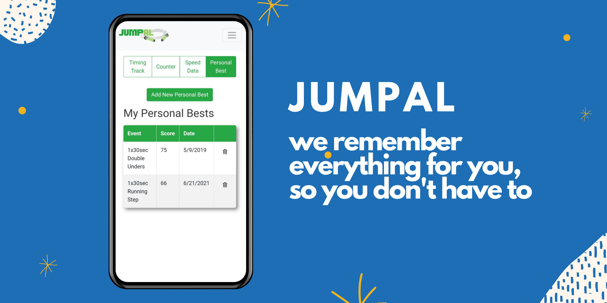

# Jumpal
A tracking app for jump rope athletes to track their speed scores, personal bests, and freestyle tricks they want to learn.

This project was bootstrapped with [Create React App](https://github.com/facebook/create-react-app).

## React Scripts

In the project directory, you can run:

**Runs the app in the development mode:** `npm start`

**Launches the test runner in the interactive watch mode:** `npm test`

**Builds the app for production to the `build` folder:** `npm run build`

## Project setup

- Add firebase configurations in `/src/Firebase/config.js` according to `config.js sample` file
- `npm install` to install dependencies
- `npm start` to start up app on localhost